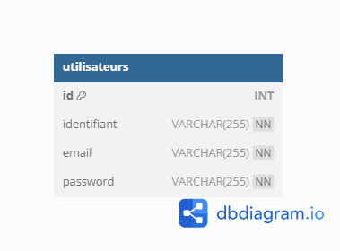

Naviguation : 

* [Racine Port-folio](https://github.com/FabHaar/projets)
* [Pipeline CI CD](https://github.com/FabHaar/projets/tree/main/Pipeline%20CI%20CD)
* [SAE51 projet 1 Mise en place et interrogation de SGBD](https://github.com/FabHaar/projets/tree/main/SAE51%20projet%201%20Mise%20en%20place%20et%20interrogation%20de%20SGBD)
* [SAE51 projet 2 Installation d’un ERP CRM](https://github.com/FabHaar/projets/tree/main/SAE51%20projet%202%20Installation%20d%E2%80%99un%20ERPCRM)
* [SAE51 projet 3 Sécurité informatique Mise en place d’un Firewall et durcissement d’un serveur Web](https://github.com/FabHaar/projets/tree/main/SAE51%20projet%203%20S%C3%A9curit%C3%A9%20informatique%20Mise%20en%20place%20d%E2%80%99un%20Firewall%20et%20durcissement%20d%E2%80%99un%20serveur%20Web)
* [SAE52 projet 1 Collecte et traitement des logs de fonctionnement](https://github.com/FabHaar/projets/tree/main/SAE52%20projet%201%20Collecte%20et%20traitement%20des%20logs%20de%20fonctionnement)

# Page Web d'inscription à un service

#### Fait par Haar Fabien et Sofianos Lucas
Groupe FI

le 13/02/2024 

# Points clés
## Résumé du script maitre `run_all.sh`
| **Etape** |                                                                                                                                           **Qu'est-ce qu'il se passe**                                                                                                                                          |
|:---------:|:---------------------------------------------------------------------------------------------------------------------------------------------------------------------------------------------------------------------------------------------------------------------------------------------------------------:|
| Purge     | On demande à l'utilisateur s'il veut faire une purge, cela permettra de détruire tout ce qui pourrait gêner la bonne execution du projet                                                                                                                                                                        |
| 1         | Création du réseau sur lequel seront mis les conteneurs, cela permettra d'interagir correctement avec la base de données                                                                                                                                                                                        |
| 2         | Lancement du conteneur mysql avec à l'aide d'options `--env` de créer directement la base de données ainsi que l'utilisateur qui permettra à l'application python de se connecter. Il y a une pause pour être sûr que le conteneur soit accessible, puis une requête est faite pour créer la table utilisateur. |
| 3         | Construction de l'image de l'application python flask                                                                                                                                                                                                                                                           |
| 4         | Lancement du conteneur de l'application python flask                                                                                                                                                                                                                                                            |
| 5         | Lancement du navigateur sur `localhost:5000` qui affiche la page d'acceuil du site. si cette étape échoue, on peut aller sur un navigateur et rentrer l'URL manuellement. 

## Base de données utilisée 

# Troubleshooting : 
## Base de données :
Avec certains systèmes, il est possible que la base de données ne soit pas créé par l'option `MYSQL_DATABASE=sae61`. Si ce bug a été observé, le script maitre alternatif `run_all2.sh` peut être lancé pour régler ce probleme. Au lieu de `run_mysql.sh` le script `run_mysql2.sh` qui au lieu de créer la base de données via la création du conteneur, le sera via une requete utilisant le client mysql de l'hôte qui donnera aussi les droits nécessaire à l'utilisateur python.